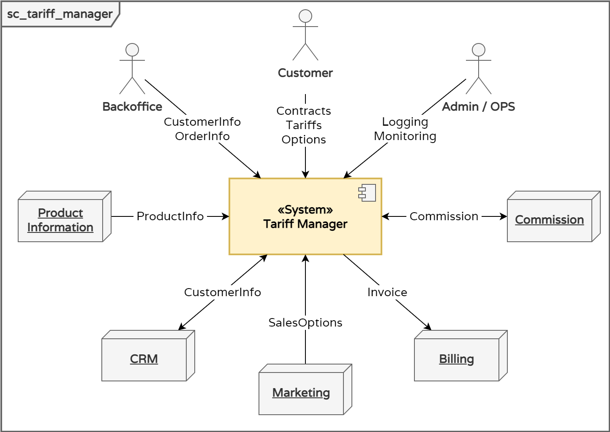
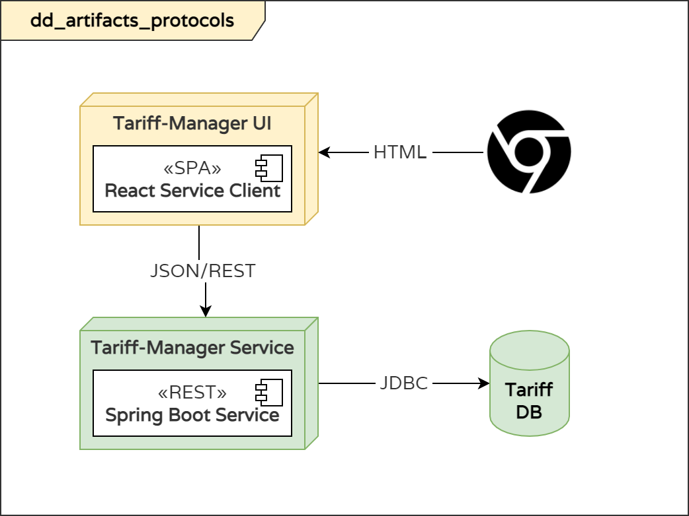
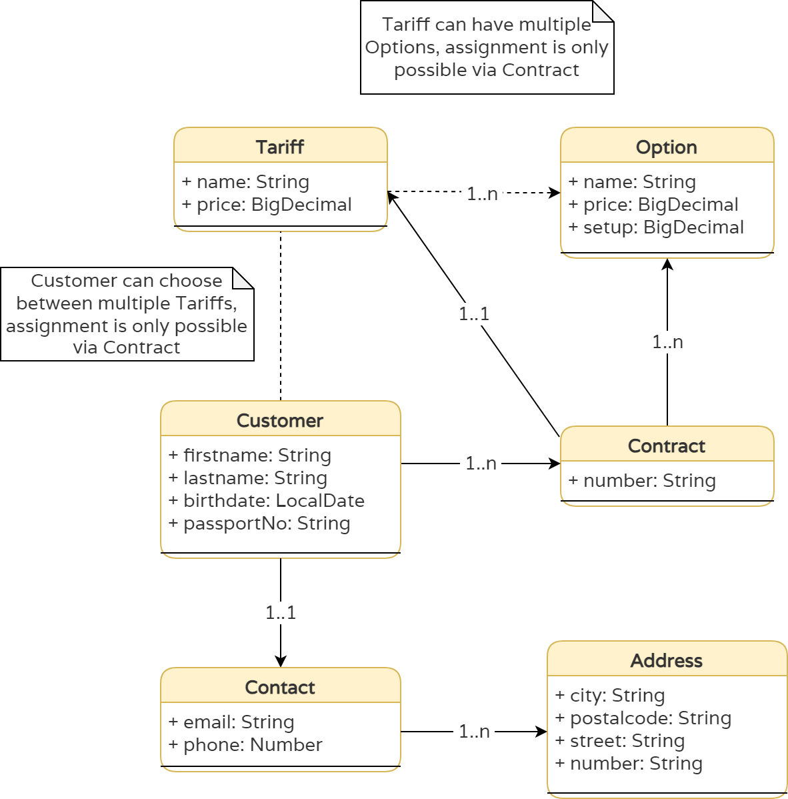
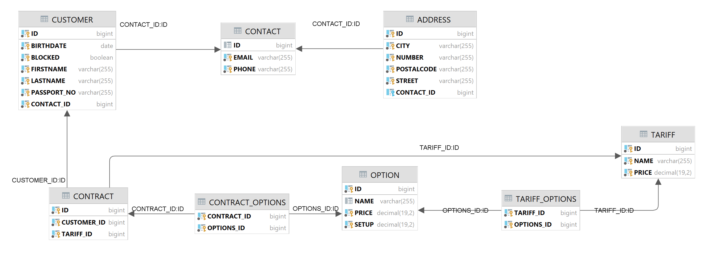
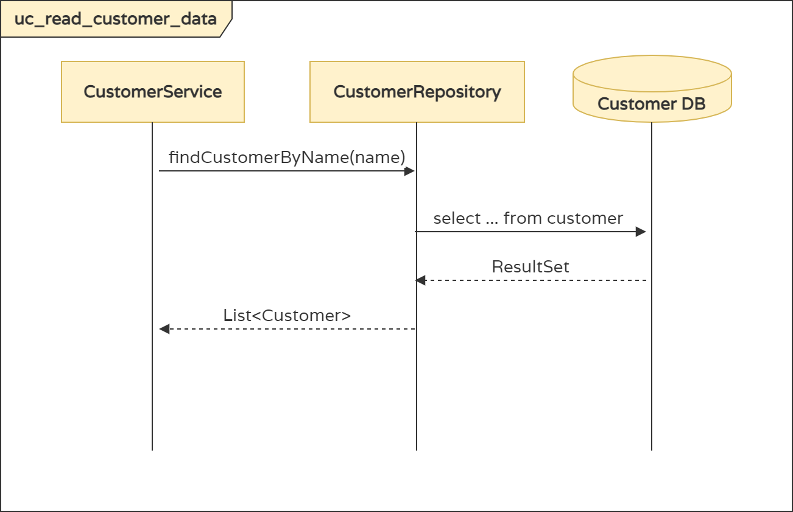
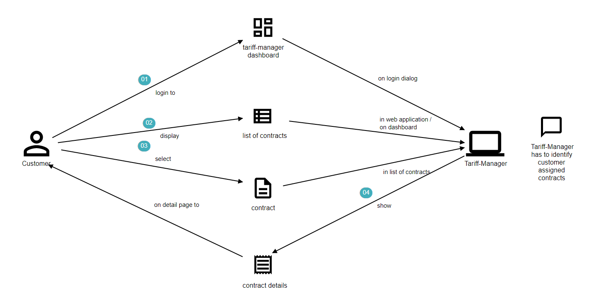
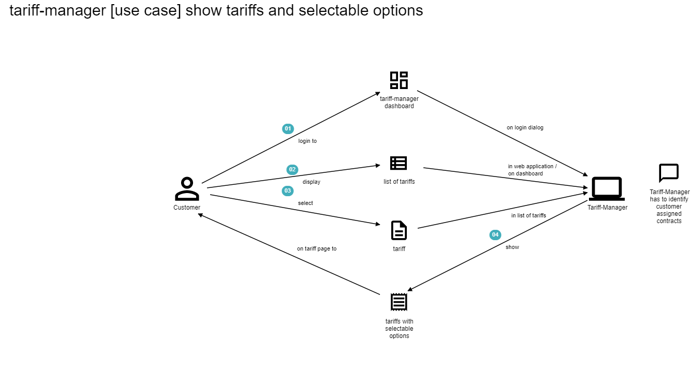

# Tariff-Manager Java & Spring Enterprise Application

Tariff-Manager Specification and Backend Service for Tutoring Java & Spring Boot in Enterprise Contexts.  
_Note: This document uses [arc42](https://github.com/arc42) for specifications & documentation._

## Introduction & Goals

This document specifies an application that simulates the operation of the information system of a cellular operator. The subject area and technical requirements are described in more detail below.  
On a meta level, this document frames the tutorials for Java & Spring Framework usage in Enterprise environments.

## Constraints

### Technical requirements

* Develop a multi-user client-server application with a network connection.
* All data is stored on the server side. 
  * Each client can download some data, after each operation, data changes must be synchronized with the server.
* The application must handle hardware and software errors. 

### Technology Stack

#### Server

* RESTful Web Services
* Build Tool Maven
* Spring Framework (Spring Boot, Spring Data JPA)
* Database Backend – MySQL

#### Client

* Browser based (Chrome, Firefox, Edge)
* Build Tool npm
* Single Page Application using React

## Business System Context



## Deployment Diagram (Components & Interactions)



## Data Model (Class Diagram)



## Entity Relationship Diagram




## Component Interactions (Sequence Diagram) 



## REST Interface

### [UC1] Display Customers



#### Request

`GET /customer`

#### Response

<details>
    <summary>Datatypes</summary>

```
[
  {
    "firstname": "string",
    "lastname": "string",
    "birthdate": "date",
    "passportNo": "string",
    "addresses": [
      {
        "address": "string"
      }
    ],
    "contractInfo": [
      {
        "tariff": "string",
        "options": [
          "string"
        ]
      }
    ]
  }
]
```

</details>

##### Sample Response

<details>
    <summary>Sample Response</summary>

```json
[
  {
    "firstname": "Kendrick",
    "lastname": "Ortiz",
    "birthdate": "1981-08-21",
    "passportNo": "036-53-2166",
    "addresses": [
      {
        "address": "031 Becker Islands 308 31966-4886 Lake Fredland"
      }
    ],
    "contractInfo": [
      {
        "tariff": "SYNERGISTIC-CONCRETE-BENCH",
        "options": [
          "small wooden pants v 17.48322"
        ]
      }
    ]
  },
  {
    "firstname": "Jc",
    "lastname": "Towne",
    "birthdate": "1979-04-29",
    "passportNo": "736-86-8610",
    "addresses": [
      {
        "address": "631 Norman Brooks 92208 37890-8042 Kendallview"
      }
    ],
    "contractInfo": [
      {
        "tariff": "DURABLE-PAPER-KNIFE",
        "options": [
          "synergistic wool keyboard v 17.19142"
        ]
      }
    ]
  }
]
```
</details>

### [UC2] Display Tariff with selectable options




#### Request

`GET /tariff`

#### Response

<details>
    <summary>Datatypes</summary>

```
[
  {
    "id": "string",
    "name": "string",
    "price": "string",
    "possibleOptions": [
      {
        "id": "string",
        "name": "string",
        "price": "string",     
        "setup": "string"      
      }
    ]
  }
]
```

</details>

##### Sample Response

<details>
    <summary>Sample Response</summary>

```json
[
  {
    "id": 957,
    "name": "SLEEK-IRON-COAT",
    "price": 25.88,
    "possibleOptions": [
      {
        "id": 956,
        "name": "gorgeous iron lamp v 12.27718",
        "price": 59.01,
        "setup": 33.88
      }
    ]
  },
  {
    "id": 960,
    "name": "SYNERGISTIC-PAPER-SHIRT",
    "price": 99.3,
    "possibleOptions": [
      {
        "id": 959,
        "name": "durable concrete shoes v 14.62467",
        "price": 58.35,
        "setup": 45.38
      }
    ]
  }
]
```
</details>

## Spring Boot Configuration

```
spring.datasource.url=jdbc:h2:./data/tariff
spring.datasource.driverClassName=org.h2.Driver
spring.datasource.username=sa
spring.datasource.password=
spring.h2.console.enabled=true
spring.jpa.hibernate.ddl-auto=update
```

## Spring Boot Specifics

### Developer Database

### OAPI / Swagger Support

* https://springdoc.org/


### Env-Specific Properties

### Automatic Schema Generation

### Reference

#### Diagrams

* Context: https://app.diagrams.net/#G1rEl42atanalQigqd9faOygsIDW7XSZM1
* Class: https://app.diagrams.net/#G1s9y-_f4spHFDbNqI9KunE7OX1JnG0FTw
* Sequence: https://app.diagrams.net/#G1joAg8E6hUbHD13t9PNJJnR8pClGaBs8I
* Deployment: https://app.diagrams.net/#G1qJHES7U5cNr5X_KfAkzZ7gasSE7KlGDK

#### Templates

* Quests: https://odyssey.wildcodeschool.com/admin/quests/1535
