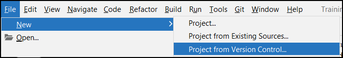
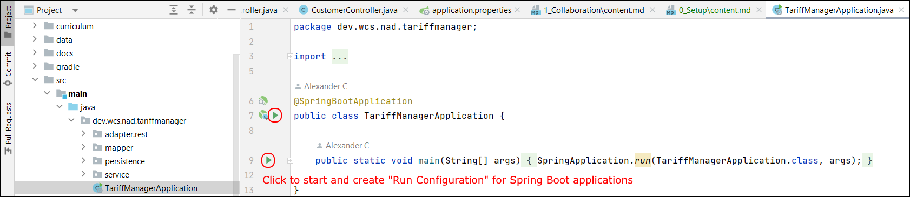
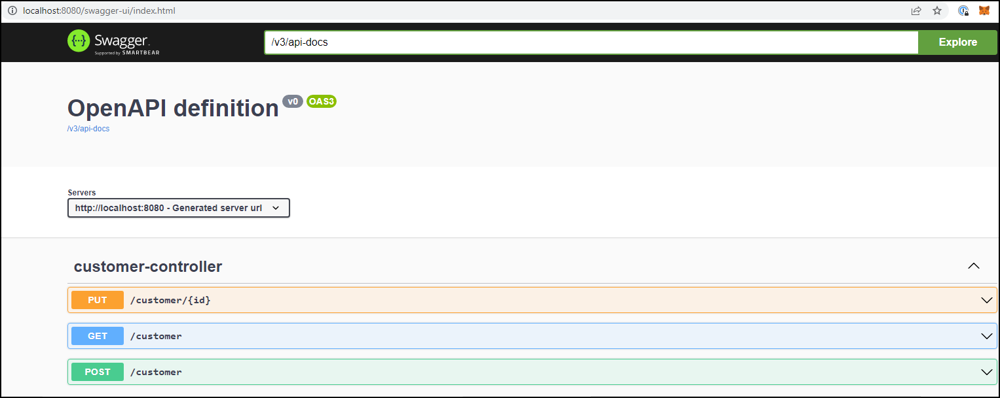

## Development Environment Setup for Tariff-Manager Web Application

In this guide, students will learn how to setup locally a Java Development Environment for the service component of the Tariff-Manager web application.

The environment setup in this guide is used throughout all walk-throughs in this tutoring.

### Prerequisites

To run the walk-throughs, these components must be installed locally and usable by the logged in user: 

* Java 11+
* Gradle
* Git client
* Editor or IDE for Java Development

#### Recommended Installation

* Download and Install [IntelliJ IDE Community Edition](https://www.jetbrains.com/idea/download/#section=windows)

_Note: When installing an IDE, all other pre-requisites are solved automatically guided by the IDE. For the walkthroughs, we assume the Java IDE IntelliJ Community Edition is installed._

#### Or manual Installation of Java, Gradle and Git client

If you choose to install the pre-requisites manually, we recommend

* [Eclipse Temurin, Latest LTS Release](https://adoptium.net/de/)
* [Gradle, Latest Release](https://gradle.org/install/)
* [Git client, Latest Version](https://gitforwindows.org/) (for [Windows](https://gitforwindows.org/)) or use [GitHub Desktop](https://desktop.github.com/)

### Cloning the GitHub Repository

* In IntelliJ, Import this Repository with **File / New / Project from Version Control**



* Use `https://github.com/ice09/tariff-manager.git` as Repository URL

### Starting the Web Application

We use Spring Boot as a Rapid Application Development Tool for Web Application in Java.

Usually newer IDEs like IntelliJ, Visual Studio Code, Eclipse or Netbeans analyze the application when its opened and identify the Tariff-Manager as a Spring Boot Web Application.

Once the identification process has been completed, the main class is identified and support for starting the Spring Boot Web application is provided.



### Automatic Environment Bootstrapping

_Note: Without any modifications, the application creates a persistent, file-based H2-SQL database in the projects folder **data**._

On application startup, the following steps will be executed automatically:

1. Create a data schema for the application in the H2 SQL database
2. Start an Apache Tomcat web application server locally on port 8080
3. Deploy the application to the running web application server

After these steps you are able to directly use the Tariff-Manager with a persistent SQL data store.

_Note: For further development or production usage, other SQL databases like MySQL or PostgreSQL can be configured._

### Using the Web Application

* Open http://localhost:8080/swagger-ui.html, you should see the OpenAPI index page



#### Executing a Use Case: Create Customer for Tariff-Manager Web Application

* Choose `POST /customer` and send this payload

```json
{
  "firstname": "Herbert",
  "lastname": "Hase",
  "birthdate": "1982-05-05",
  "passportNo": "54333-DXD-987-55"
}
```

#### Verify the Customer Creation

##### With REST

* Choose `GET /customer` which returns all stored customers. Herbert should be included.

##### In the Database

* Go to http://localhost:8080/h2-console/login.jsp and use JDBC URL `jdbc:h2:./data/tariff` with user `sa` and no password
  * `SELECT * FROM CUSTOMER WHERE FIRSTNAME='Herbert'` should return the created customer. 
