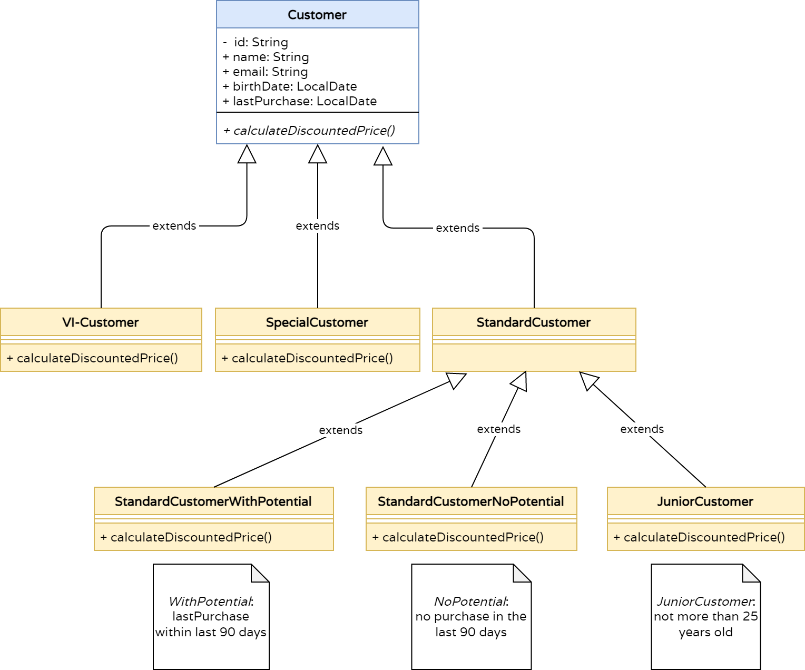

## Advanced Java Concepts: Inheritance & Polymorphism, File Handling, Collections

### Objective

With a Reporting Tool for the Tariff-Manager, concepts of Object-Oriented Programming are deepened and Java SDK utilities like File I/O, String handling and different methods of traversing collections are introduced.

### What you will learn

* Advanced Structures in Java: Collections, Data Structures
* Loops, Conditions for Java <8 and newer versions
* Streams and Lambdas
* Little Helpers: Lombok

### Use Case Reporting Tool: Generate Customer Reports for Sales Optimization

```
As a controller, I want to create reports about customers with all relevant data.
```

### Sequence for Data Model Creation and Report Generation

For our walk-through, we will implement the following steps:

#### Import `Customers` from CSV file `src/test/resources/customers.csv` and Create OOP Object Model

Create Java objects from CSV lines as specified in the class diagram



##### Data Formats and Conversion Rules

* All `Customers` have `ID`, `name`, `email` address, `birthdate`, `lastPurchase` dates and `type`
* The following types of `Customers` exists: `StandardCustomer`, `SpecialCustomer`, `VICustomer`
* There are three specializations of `StandardCustomer`: `JuniorCustomer`, `StandardCustomerWithPotential`, and `StandardCustomerNoPotential` 
* All `Customers` implement a `calculateDiscountedPrice(int price)` method, which calculates and returns the discount depending on the type of `Customer`
* The type of `Customer` is determined by the last column of the CSV file: `S,E,V`

#### Conversionlogic as Pseudo-Code

* For each file: Split each line into a String array, use the correct separator string ","
* For each line: Convert each line into an object of the correct type of Kunde

_Note: If a line cannot be converted due to errors, log the ID and continue processing_

```
IF (TYPE='E')
   NEW SPECIALCUSTOMER
ELSE IF (TYPE='V')
   NEW VICUSTOMER
ELSE IF (TYPE='S') AND (AGE < 25)
   NEW JUNIORCUSTOMER
ELSE IF (TYPE='S') AND (LAST_PURCHASE < 90 DAYS)
   NEW STANDARDCUSTOMER_WITH_POTENTIAL
ELSE
   NEW STANDARDCUSTOMER_NO_POTENTIAL
```

* The import is implemented in a dedicated class `CustomerImporter`

### Less Boilerplate with Lombok

In this project we use external libraries with care as they might not be allowed in your environment and to minimize dependencies if not strictly necessary.

However, if the following criteria are met, we introduce external libraries:

* The library is established, well-known and proven in productive code.
* The library helps writing less error-prone code.
* The dependency on the library can be removed without any negative side-effects.

All these criteria are true for Lombok, which is why we introduce it for out "value classes" (ie. POJOs: Plain Old Java Objects).

#### Code Generation with Lombok in Action

Please see the commented section in [Customer](../../../src/main/java/dev/wcs/nad/tariffmanager/customer/model/Customer.java) to understand what boilerplate code is generated by Lombok, which derives the code from the properties of the class. 
Lombok enhances the compiled Java byte code, so no dependency on Lombok is present in the compiled code, only for compile time.  

_Note: You can at any time _delombok_ your application and get rid of Lombok completely._

### Challenge: Implement the Data Import Process

We will simulate a bootstrapping of the Web application by importing a CSV file with all customer data.
After the data is imported and the data model set up, we will run the Report engine for Reporting about imported Customers.

1. Add all `Customer` objects to a new `List<Customer>`
2. Create a method which prints only `Customers` of type `type` with this signature: `List<Kunde> filterKunden(List<Kunde> allKunden, String type)`
3. Create a method which sorts `List<Customer>` by `name`: `List<Customer> sortByName(List<Customer> customer)`
4. Create a method which sorts `List<Customer>` by `lastPurchase`: `List<Customer> sortByLastPurchase(List<Customer> customer)`
5. This should be implemented in class `CustomerSales`, the class and the method should be implemented using TDD

### Challenge: Newsletter for Classified Customer  

6. Create a method `sendNewsletter(List<Customer> customers)` which sends a newsletter to `VI-Customers` and `StandardCustomersWithPotential`: **Hello NAME, you are invited to our new product demo.**