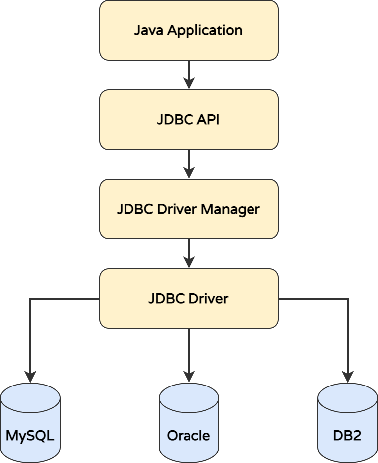
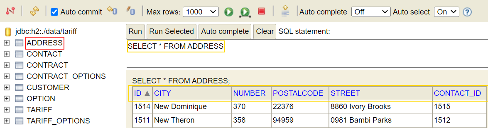

# Java and Relational Databases: JDBC

In this quest you will learn about accessing relational databases with SQL and from Java with JDBC.

### What you will learn

* SQL and Relational Databases
* Object-Relational Mapping with Java
* Accessing Relational Databases from Java with JDBC

### What you should know

* Java Basics

### Prerequisites

* Locally cloned Repository
* IDE (IntelliJ) with Gradle
* Java SDK 11+

### Accessing Relational Databases from Java



_Call Delegation for Accessing different Relational Databases in Java_

### Interfaces for Database Interaction

Follow all steps with documentation in [CustomerLegacyDao](../../../src/main/java/dev/wcs/nad/tariffmanager/persistence/jdbc/CustomerLegacyDao.java)

#### Steps for plain JDBC Access with Spring Configured DataSource

1. Import JDBC packages _[Line 10]_
2. Create Connection in method `getByIdJava7Syntax` from `DataSource` (ie. a Connection Pool maintained by the Spring runtime environment) _[Line 32]_
3. Call `preparedStatement` on `Connection` _[Line 40]_
4. Get `ResultSet` from `Statement` with `executeQuery` _[Line 46]_ 
5. Read results from `ResultSet` and map values _[Line 51]_


### Manual JDBC Connection/Statement/ResultSet Handling

See the following code extract for a _trx-with-finally_ version of manual JDBC handling. Since Java 7 this is the best practice for manual JDBC handling.

<details>
    <summary>Manual JDBC Connection/Statement/ResultSet Handling in Java</summary>

```java
public Optional<Customer> getByIdJava7Syntax(int id) {
        // We use try-catch-finally introduced in Java 7
        try (Connection connection = dataSource.getConnection();
        // NOTE
        // For security reasons: Always use PreparedStatements, not Statement
        PreparedStatement stmt = connection.prepareStatement("my_call");
        ResultSet resultSet = stmt.executeQuery()) {
        while (resultSet.next()) {
        String value = resultSet.getString(1);
        System.out.println(value);
        }
        } catch (SQLException sqlException) {
        sqlException.printStackTrace();
        }
        return Optional.empty();
        }
```
</details>

In [CustomerLegacyDao](../../../src/main/java/dev/wcs/nad/tariffmanager/persistence/jdbc/CustomerLegacyDao.java) you see in method `getByIdBeforeJava7` the pre Java 7 version which is sometimes used in tutorials. This code is for educational purposes only and should not be used anymore as the risk of having memory leaks by non closed connections/statements/resultsets is too high.

### Challenge: Query Customers with plain JDBC

_Note: You must have executed [InitialDatabaseSetupManualTest](../../../src/test/java/dev/wcs/nad/tariffmanager/InitialDatabaseSetupManualTest.java) at least once to have test data generated in the database before running the steps below. You might have to delete the `data` folder before!_ 

* Execute and follow the call sequence of unit test [CustomerJdbcTest](../../../src/test/java/dev/wcs/nad/tariffmanager/customer/CustomerJdbcTest.java).
* Understand how the data travels from the database to the Java object model.
* Understand how the manual mapping to a Object graph works.
* Implement the unit test [AddressJdbcTest](../../../src/test/java/dev/wcs/nad/tariffmanager/address/AddressJdbcTest.java)
  * Implement `AddressLegacyDao` in the same way as `CustomerLegacyDao`
  * Implement the mapping from `ResultSet` to `Address`

_ADDRESS Table Data in local H2 Database Storage after Testdata creation._



### Access the database

* Start `TariffManagerApplication` 
* Open http://localhost:8080/h2-console/login.jsp
