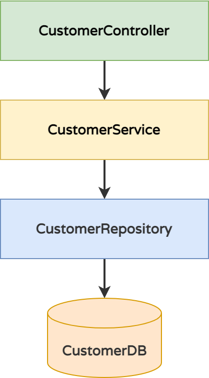

# Dependency Injection & Inversion of Control with the Spring Framework 

In this block, Students learn how to implement enterprise-grade, modular software systems with DI/IoC Frameworks.

### What you will learn

* Introduction to modular enterprise development with IoC/DI (Spring)
* Differences between injection and creation of objects
* Use cases for Dependency Injection and Inversion of Control

### What you should know

* Java Basics
* Advanced Principles of Object-Orientated Programming

### Prerequisites

* Locally cloned Repository
* IDE (IntelliJ) with Gradle
* Java SDK 11+

### Inversion of Control and Dependency Injection

Without a Dependency Injection Framework which provides Inversion of Control, the dependencies of the components would be strong and strict and defined at compile-time already, resulting in a highly unflexible and unextendible architecture.

The Controller should not be responsible for the Service, the Service should not be responsible for the Repository etc. This pattern clearly violates the Seperation of Concerns best practice.



```java
// Instantiate Controller - but what Service should be used?
CustomerController customerController = new CustomerController(???);

// Instantiate Service - but what Repository should be used?
CustomerService customerService = new CustomerService(???);

// Instantiate Repository, but with what Datasource?
CustomerRepository customerRepository = new CustomerRepository(???);

// This would have to be created on startup:
String databaseParameter = "USERNAME:PASSWORD@DB_URL:DB_PORT/DB_SCHEMA/";
CustomerRepository customerRepository = new CustomerRepository(databaseParameter);
CustomerService customerService = new CustomerService(customerRepository);
CustomerController customerController = new CustomerController(customerService);
```

#### Delegating Class Instantiations and Object Graph Creation to Runtime Containers

With a Dependency Injection and Inversion of Control Framework like Spring, the dependencies can be controlled at Runtime.


You will find the components mentioned here in the code base of this repo.  
To understand the use cases and advantages of using Spring, scan through the code to answer these questions:

* Where are they located?
* How does the wiring work with Spring?
* Who does wire what components when?

```java
// Give DI/IoC Framework hints by Annotations, Depend on Interfaces only.
// The Runtime Container (Spring Boot/Spring Framework) will build the object graph on startup.
// All dependencies are runtime dependencies only, not compile-time dependencies.

@Controller
public class CustomerController {
    private final CustomerService customerService;
    
    public CustomerController(CustomerService customerService) {
        this.customerService = customerService;
    }
} 

@Service
public class CustomerService {
    private final CustomerRepository customerRepository;

    public CustomerService(CustomerRepository customerRepository) {
        this.customerRepository = customerRepository;
    }
}

@Repository
public class CustomerRepository {
    //...
}
```

### Challenge: Add Configuration for Services

The default Spring Boot Configuration is in [application.properties](../../../src/main/resources/application.properties)

* Understand how configuration can be added in external files like `application.properties`
  * Compare the existing property `junior.customer.discount.percent` and how it is used in [CustomerImporter](../../../src/main/java/dev/wcs/nad/tariffmanager/customer/reporting/CustomerImporter.java) to instantiate the value in [JuniorCustomer](../../../src/main/java/dev/wcs/nad/tariffmanager/customer/model/JuniorCustomer.java) 
* Add a new configuration property `TYPE.customer.discount.percent` (with TYPE being *vi* or *special*) which can be injected to the class which creates the objects, eg. `CustomerImporter` or a unit test. The specific subclasses of `Customer` must accept this discount in a constructor instead of having a static value in the `calculateDiscount` method.
* Set the `discount` properties to 5, 10 and 15 per cent in `application.properties` and re-run all tests with the property injection.

### Challenge: Add Mapping for Entity <-> DTO

* We prepared a simple mapping class [CustomerMapper](../../../src/main/java/dev/wcs/nad/tariffmanager/mapper/simple/CustomerMapper.java) which maps DTOs to Entities. This class is currently not used.
* Add the Mapper as a Spring component (with the `@Component` annotation), use it in the Service class to map between both types of objects.
* See [CustomerMapperTest](../../../src/test/java/dev/wcs/nad/tariffmanager/customer/CustomerMapperTest.java) unit test to understand how test can be written for Spring components. 
* Extend the `CustomerMapperTest.shouldMapObjects` unit test for the Service methods `convertEntityToDto` and `mapDtoToEntity` with the injected Mapper object.
