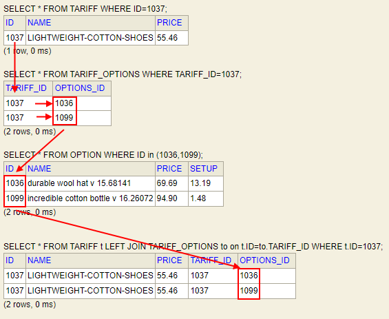
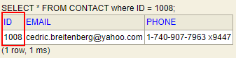
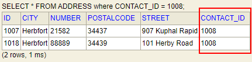
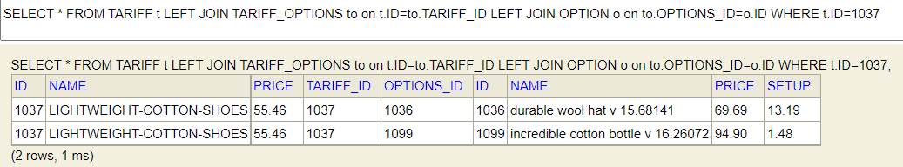
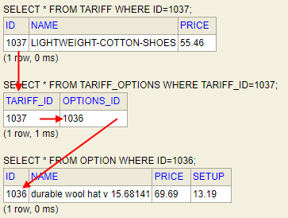

# Spring Data JPA

In this quest you will learn about querying a storage with Spring Data using JPA. 

### What you will learn

* Spring Boot (Web Dev): Spring MVC, Spring Data, Spring Security
* Java and Relational Databases: JDBC
* Persistence with ORM in Java: JPA

### What you should know

* Java Basics
* Spring DI/IoC
* Java Persistence with JDBC

### Prerequisites

* Locally cloned Repository
* IDE (IntelliJ) with Gradle
* Java SDK 11+

## Introducing the Java Persistence API (JPA)

In this walk-through you will learn how to model a specific Data Model in JPA.

### Entities in Domain "Tariff-Manager"

#### Tariff

* Tariff name
* Price
* List of possible options

#### Option

* Option name
* Price
* Connection cost for option

#### Customer

* Customer name
* Last Name
* Date of birth
* Passport data
* Address

#### Contract

* Contract number
* Tariff
* Selected options for the tariff

### Data Model as Entity Relationship Diagram


## Create JPA Classes

### Class Diagramm of Corresponding JPA Diagram


### Entity Annotations

To enable Object-Relational Mapping (ORM) between Java objects and database entities, Java classes have to be enriched with meta information about how to map related models, what and how much of the object graph to load in one shot and other properties.

JPA uses specific annotations (or XML configuration) to define the intended behaviour. All JPA Entities in package *entity* have these annotations.  

[sources](../../../src/main/java/dev/wcs/nad/tariffmanager/persistence/entity/) | [GitHub](../../../src/main/java/dev/wcs/nad/tariffmanager/persistence/entity/)

### Modelling One-to-Many Relations

We will investigate the `Contact` to `Address` relation. This relation models the fact "A contact can have many addresses".
This relation type is called `One-to-Many` (1..n) in JPA. In Java, we use a collection (in our case a `List`, but `Set` or `Collection` would be possible as well) to model 1..n relationsships.

```
@OneToMany(mappedBy = "customer", orphanRemoval = true)
private List<Contract> contracts = new ArrayList<>();
```
[sources](../../../src/main/java/dev/wcs/nad/tariffmanager/persistence/entity/Customer.java) | [GitHub](../../../src/main/java/dev/wcs/nad/tariffmanager/persistence/entity/Customer.java#L28)



#### Adding an `Address` to a `Contact`

If we want to add an `Address` to a `Contact` object, we have to use the interface a `List` provides to add an object. Futhermore, we have to persist the change in the database.

```java
Address address = createFakeAddress();
Contact contact = createFakeContact();
contact.addAddress(address);
addressRepository.save(address);
customer = customerRepository.save(customer);
```

[sources](../../../src/test/java/dev/wcs/nad/tariffmanager/InitialDatabaseSetupManualTest.java) | [GitHub](../../../src/test/java/dev/wcs/nad/tariffmanager/InitialDatabaseSetupManualTest.java#L32)

First, we create a new `Address` which we add to the `Contract`. This is done by calling `add(...)` on the `List` of `Address`. Now the object has been added to the List in memory, but it wasn't persisted. To persist the object in the database, we first have to persist the new `Address` with `addressRepository.save(address)`. Now an ID has been added by JPA and we can store the `Contact` object with the `List` of `Address` with `customerRepository.save(customer)`.

In the database, the **ADDRESS** table, column **CONTACT_ID** has a Foreign Key to the **CONTACT** table, column **ID**.  





It can be specified in the annotations on the classes `Address` and `Contact` how the relationsship should be modelled in the database. Out approach is the most common choosed approach, but other options exist, eg. using a intermediate table.

### Modelling Many-to-Many Relations



```java
@ManyToMany
@JoinTable(name = "contract_options",
        joinColumns = @JoinColumn(name = "contract_id"),
        inverseJoinColumns = @JoinColumn(name = "options_id"))
private Set<Option> options = new LinkedHashSet<>();
```
[sources](../../../src/main/java/dev/wcs/nad/tariffmanager/persistence/entity/Contract.java) | [GitHub](../../../src/main/java/dev/wcs/nad/tariffmanager/persistence/entity/Contract.java#L25)


### Modelling One-to-One Relations



```java
@OneToOne(orphanRemoval = true)
@JoinColumn(name = "tariff_id")
private Tariff tariff;
```
[sources](../../../src/main/java/dev/wcs/nad/tariffmanager/persistence/entity/Contract.java) | [GitHub](../../../src/main/java/dev/wcs/nad/tariffmanager/persistence/entity/Contract.java#L21)

### Modelling Many-to-One Relations

```java
@ManyToOne
@JoinColumn(name = "contact_id")
private Contact contact;
```
[sources](../../../src/main/java/dev/wcs/nad/tariffmanager/persistence/entity/Address.java) | [GitHub](../../../src/main/java/dev/wcs/nad/tariffmanager/persistence/entity/Address.java#L24)

### Challenge: Add a new Entity `Department` 

* `Tariff` has a n..0 (many-to-zero_or_one) relation to a new entity `Department`, which specifies which internal department is responsible for the `Tariff`
* Create a repository for `Department` which allows for reading, creating and updating `Department` entities (interface method: ...)
* In the unit test a `Tariff` is created. Modify the test: Create and persist a new `Department`. Make sure that each time a `Tariff` is created, this `Department` is associated and persistet.

