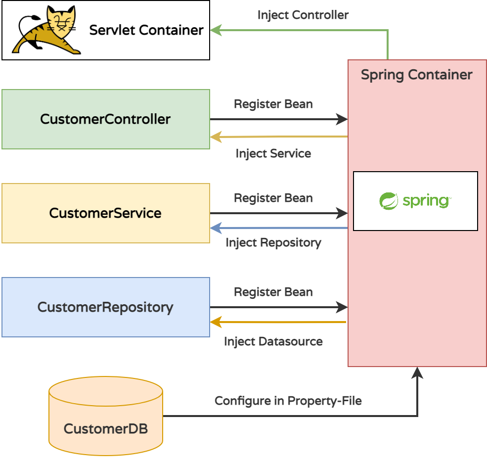

# REST APIs with Spring Boot

In this quest you will learn about REST Services and how to rapidly build and document REST Service Interfaces with Spring Data JPA and Spring Boot. 

### What you will learn

* Spring Boot (Web Dev): Spring MVC & Spring Data
* Spring Boot REST: OpenAPI, Swagger and JSON Data Binding
* Securing REST Services with Spring Security

### What you should know

* Java Basics
* Spring DI/IoC
* Java Persistence with JDBC

### Prerequisites

* Locally cloned Repository
* IDE (IntelliJ) with Gradle
* Java SDK 11+

## Spring DI/IoC, Spring Boot and REST

To understand why Spring Boot accelerates Web Application Development 



If you run the application, you can access the REST endpoint (`CustomerController.displayCustomer`) at http://localhost:8080/customer

The `CustomerController` is instantiated by the Spring Container and the object graph containing the `ContainerService` and the `ContainerRepository` in injected.

With Spring Dependency Injection all required dependencies are provided during runtime. All layers requirements are met before the application startup is completed. With this guarantee, the components can focus on their requirements and do not have to take care about how these requirements are met (by the Spring Container runtime environment).

```java
@GetMapping("/customer")
public List<CustomerDto> displayCustomers() {
    List<CustomerDto> customerDtos = new ArrayList<>();
    for (Customer customer: customerService.readAllCustomers()) {
        customerDtos.add(entityToDtoMapper.customerToCustomerDto(customer));
    }
    return customerDtos;
}
```

### Challenge: Add a new GET Endpoint with Result Set Filtering

```
A new Endpoint should be added for unrestricted access to products. 
The Enpoint should verify the age of all customers who are 18 or older.
```

See here

* After retrieving all customers from the database, create a `Stream` and filter for all customers aged 18 or older.
* Make sure that a parameter `searchFilter` can be passed as a `QueryParam` to further filter the stream for all customers aged >= 18 and name startsWith searchFiler.
* Pass the parameter searchFilter "down" further the layers to optimize performance (not loading all customers, with only the ones containing the searchFilter and age > 18).

### Challenge: Make maturity age Configurable

* Currently, the age (18) is hard wired into the Service. Use `application.properties` to make it configurable. You can choose the property name, you can also use `maturity.age`.

```java
// Give DI/IoC Framework hints by Annotations, Depend on Interfaces only.
// The Runtime Container (Spring Boot/Spring Framework) will build the object graph on startup.
// All dependencies are runtime dependencies only, not compile-time dependencies.

@Controller
public class CustomerController {
    private final CustomerService customerService;
    
    public CustomerController(CustomerService customerService) {
        this.customerService = customerService;
    }
}
```

